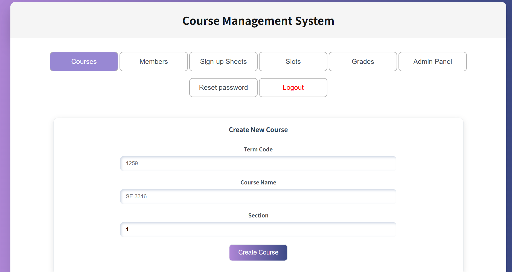
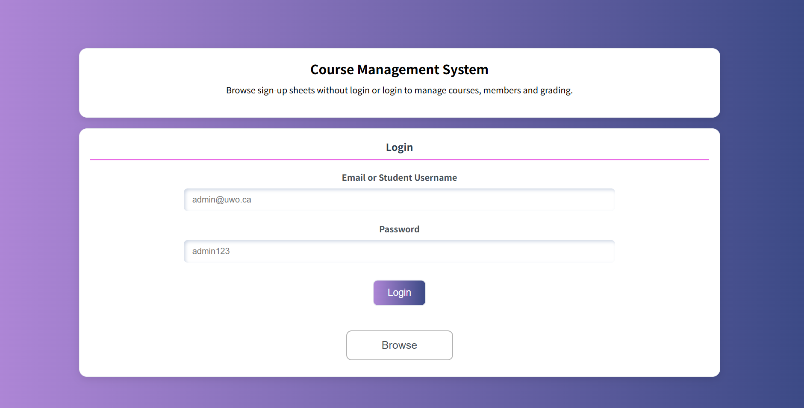

# Course Management System

A web-based Course Management System that allows users to browse sign-up sheets and securely access role-based course management features. The system supports students, TAs, and administrators, with different permissions for scheduling, enrollment, grading, and account management.

---

## Description

This project is a full-stack web application designed to manage course-related activities in an organized and secure way.  
Unauthenticated users can search and browse sign-up sheets, while authenticated users can access additional features based on their role.

- **Students** can view available slots, sign up for slots, leave slots, and see their grades.
- **TAs** can manage courses, members, sign-up sheets, slots, and grading.
- **Administrators** can perform all TA functions and also manage TA privileges and reset user passwords.

The application was developed with a React front end and a Node.js/Express back end, with input validation and sanitization to improve security and reliability.

---

## Features

### Public Features
- View the home page with application information
- Search sign-up sheets by course code
- Expand results to view slot details

### Student Features
- Log in securely
- Change password on first login
- View enrolled slots
- View available slots
- Sign up for eligible slots
- Leave eligible slots
- View grades and assignment-related information

### TA Features
- Create, modify, and delete courses
- Add and delete members
- Upload members using a CSV file
- Create and delete sign-up sheets
- Add, modify, and delete slots
- Access grading mode
- Enter and update marks, bonuses, penalties, and comments
- View audit information for the last grade change

### Administrator Features
- Perform all TA functions
- Add or remove TA privileges
- Reset passwords for users

---

## Security and Validation

This project includes basic security measures to improve robustness and reduce the risk of malicious input.

- Input validation for required fields
- Range and type checking for numeric values
- Length restrictions for text fields
- String sanitization to prevent user input from being interpreted as HTML or JavaScript
- Safer JSON file access with file name validation
- Role-based access control for protected functionality

---

## Tech Stack

**Front End**
- React
- HTML
- CSS
- JavaScript

**Back End**
- Node.js
- Express.js

**Other**
- JSON file storage
- JWT-based authorization
- CSV-based bulk user import

---

## Project Structure

```text
client/    # React front-end
server/    # Node.js / Express back-end
server/data/   # JSON data files

---
### Home Page


### Course Management Page


